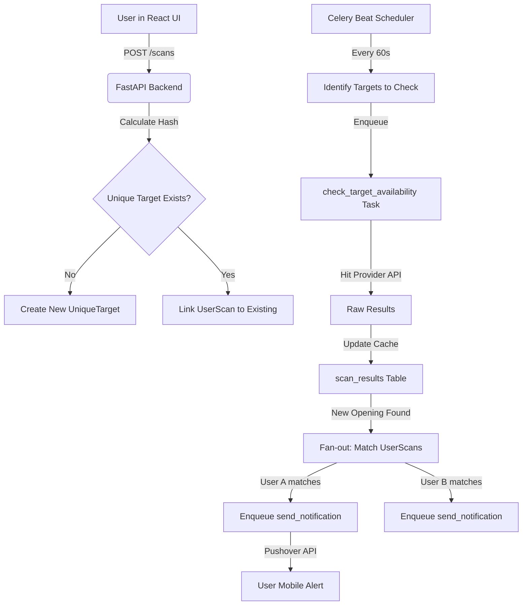

# ARCHITECTURE_DEEP_DIVE: The Smart De-duplicated Poller

This document explains the technical implementation and reasoning behind the core scanning engine of `camply`.

## 🎯 The Problem: API Bans & Inefficiency
In a multi-user system, multiple users often want to watch the same popular campgrounds (e.g., Lower Pines in Yosemite) for the same dates.
- **Legacy Approach**: 10 users = 10 API calls every minute. **Result**: IP ban from Recreation.gov.
- **Smart Approach**: 10 users = 1 API call every minute. **Result**: High performance and API safety.

---

## 🏗️ The Data Flow (User to Alert)

---

## 🔄 The `UniqueTarget` State Machine

A `UniqueTarget` represents a background polling job. Its lifecycle is:

1.  **Initialized**: Created when the first user subscribes to a park/date range.
2.  **Active**: `is_active=True`. Polled by the worker as long as at least one linked `UserScan` is active.
3.  **Cooldown**: After a check, `last_checked_at` is updated. It won't be checked again until the provider's `rate_limit_interval` has passed.
4.  **Dormant**: If all users delete their scans for this target, `is_active` becomes `False`. The record remains for history but the worker skips it.

---

## 📣 The "Fan-out" Notification Logic

We separate **Checking** from **Notifying** to ensure high throughput.

1.  **The Poller** is "Blind": It just wants to know "What sites are open for Park X between Date A and B?".
2.  **Standardization**: Raw results are converted into `CampsiteDTO`s.
3.  **Matching**: The worker queries the `user_scans` table for that `target_id`.
4.  **Filtering**:
    - *User A* only wants **Electric** sites.
    - *User B* wants **any** site but for **3+ nights**.
    - The worker checks the `CampsiteDTO` list against these filters.
5.  **Individual Alerts**: A user is only alerted if their specific criteria are met, even if other sites are open.

---

## 🔒 Concurrency & Locking

To prevent race conditions (two workers checking the same park simultaneously):
- We use **Valkey Distributed Locks**.
- Before a `check_target_availability` task starts, it attempts to acquire a lock: `lock:target_id`.
- If the lock is held, the task exits immediately.
