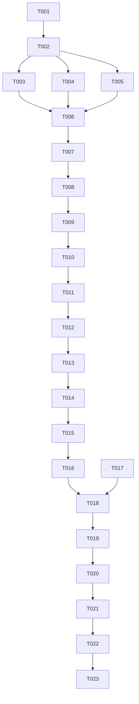

# Tasks: Provider Engine (BaseProvider ABC)

**Feature**: Provider Engine Implementation
**Branch**: `001-provider-engine`
**Status**: Not Started

## Implementation Strategy

We will follow an incremental approach, starting with the core interfaces (ABC and DTO) before implementing the first concrete provider (Recreation.gov). Each user story will be independently testable using mock providers before the real migration begins.

1.  **Foundational Phase**: Define the "Contract" (Exceptions, Enums, DTOs).
2.  **Core Interface**: Implement the `BaseProvider` ABC.
3.  **Validation**: Verify the contract with a mock provider.
4.  **Migration**: Port the `recreation_dot_gov` logic from legacy CLI to the new package.

## Phase 1: Setup

- [ ] T001 Verify `backend/packages/providers` directory structure exists
- [ ] T002 Update `backend/packages/providers/pyproject.toml` with `httpx`, `pydantic`, `SQLAlchemy`, and `structlog`

## Phase 2: Foundational

- [ ] T003 [P] Create standardized exceptions in `backend/packages/providers/providers/exceptions.py` (`ProviderError`, `RateLimitError`, `AuthError`, `InvalidParkError`)
- [ ] T004 [P] Create `CampsiteType` Enum in `backend/packages/providers/providers/dto.py` (`TENT`, `RV`, `CABIN`, `GROUP`, `OTHER`)
- [ ] T005 [P] Create `CampsiteDTO` Pydantic v2 model in `backend/packages/providers/providers/dto.py`

## Phase 3: User Story 1 - Provider Implementation (Priority: P1)

**Story Goal**: Define the `BaseProvider` ABC to ensure all providers follow the same contract.
**Independent Test Criteria**: A mock class can inherit from `BaseProvider`, implement all methods, and be instantiated without `TypeError`.

- [ ] T006 [US1] Define `BaseProvider` ABC in `backend/packages/providers/providers/base.py`
- [ ] T007 [US1] Implement `httpx.AsyncClient` initialization and lifecycle in `BaseProvider.__init__`
- [ ] T008 [US1] Define abstract properties `id` and `provider` in `BaseProvider`
- [ ] T009 [US1] Create unit test in `backend/packages/providers/tests/test_base_interface.py` to verify ABC enforcement

## Phase 4: User Story 2 - Availability Scanning (Priority: P1)

**Story Goal**: Standardize the `find_availabilities` method and its return type.
**Independent Test Criteria**: Calling `find_availabilities` on a mock provider returns a list of `CampsiteDTO` objects.

- [ ] T010 [US2] Define abstract async method `find_availabilities` in `BaseProvider`
- [ ] T011 [P] [US2] Implement a `MockProvider` in `backend/packages/providers/tests/conftest.py` for testing
- [ ] T012 [US2] Create test cases for `find_availabilities` return type validation in `backend/packages/providers/tests/test_base_interface.py`

## Phase 5: User Story 3 - Metadata Synchronization (Priority: P2)

**Story Goal**: Standardize the `sync_metadata` method and database update logic.
**Independent Test Criteria**: Calling `sync_metadata` triggers the expected database upserts (using mocks for the DB session).

- [ ] T013 [US3] Define abstract async method `sync_metadata` in `BaseProvider`
- [ ] T014 [US3] Move shared `populate_search_table` logic into `BaseProvider` (or a mixin) in `backend/packages/providers/providers/base.py`
- [ ] T015 [US3] Create test cases for `sync_metadata` database interaction in `backend/packages/providers/tests/test_base_interface.py`

## Phase 6: Migration - Recreation.gov Provider

**Goal**: Port the first real provider to the new engine.

- [ ] T016 [P] Create `backend/packages/providers/providers/recreation_gov/models.py` with Pydantic internal models and `to_dto()` methods
- [ ] T017 [P] Create `backend/packages/providers/providers/recreation_gov/client.py` for async API interactions
- [ ] T018 Implement `RecreationGovProvider` class in `backend/packages/providers/providers/recreation_gov/provider.py`
- [ ] T019 Create integration tests with VCR cassettes in `backend/packages/providers/tests/recreation_gov/test_scanning.py`
- [ ] T020 Create metadata sync tests in `backend/packages/providers/tests/recreation_gov/test_metadata.py`

## Phase 7: Polish & Cross-Cutting Concerns

- [ ] T021 Run `task lint` and fix any issues in `backend/packages/providers`
- [ ] T022 Run `task check` to verify type safety in `backend/packages/providers`
- [ ] T023 Ensure all public methods have docstrings and type hints

## Dependency Graph

## Parallel Execution Examples

- **Foundational**: T003, T004, and T005 can be done in parallel as they are independent files.
- **Provider Migration**: T016 and T017 can be developed in parallel as they focus on models vs. client logic.
